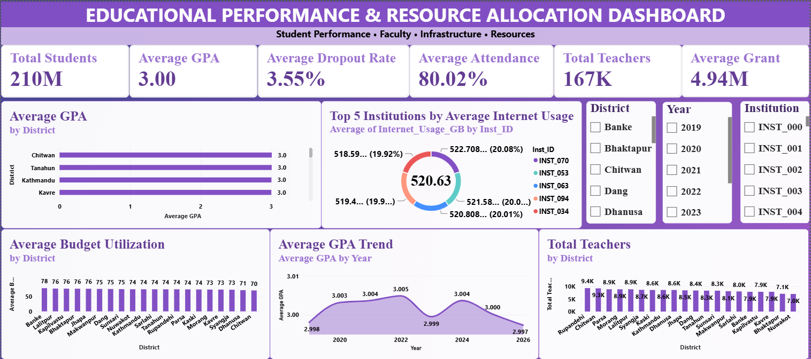

# 📊 CodeAlpha Educational Performance & Resource Allocation Dashboard

An interactive **Power BI dashboard** developed as part of the **CodeAlpha Internship Project – Task 4: Educational Performance and Resource Allocation**.

The dashboard analyzes educational performance, faculty resources, infrastructure usage, budget utilization, and district-wise patterns to support **data-driven decision-making in educational management**.

---

## 🎯 Project Objective

The main objective of this project is to develop an interactive dashboard that helps evaluate:

- 📚 Student academic performance
- 👩‍🏫 Faculty and teacher resources
- 💰 Budget and grant utilization
- 🌐 Infrastructure and internet usage
- 🏫 Institution-level performance
- 📍 District-wise educational patterns

The dashboard brings these indicators together in a single-page interactive view to make educational data easier to understand and analyze.

---

## 📌 CodeAlpha Task Requirements

This project was developed according to the requirements of **Task 4: Educational Performance and Resource Allocation**.

### Expected Features

- ✅ Visualize academic performance metrics
- ✅ Analyze resource usage and identify potential gaps
- ✅ Support data-driven decisions in education management

The dashboard addresses these requirements through KPIs, interactive charts, slicers, and comparative analysis.

---

## 📈 Dashboard Overview

The dashboard provides a consolidated view of **Student Performance, Faculty, Infrastructure, and Resources**.

### Key Performance Indicators (KPIs)

| KPI | Value |
|---|---:|
| 👨‍🎓 Total Students | 210M |
| 🎓 Average GPA | 3.00 |
| 📅 Average Attendance | 80.02% |
| ⚠️ Average Dropout Rate | 3.55% |
| 👩‍🏫 Total Teachers | 167K |
| 💰 Average Grant | 4.94M |

These KPIs provide a quick overview of the overall educational environment before exploring detailed visualizations.

---

## 📊 Visualizations Included

### 1. Average GPA by District

Compares the average GPA across different districts to identify variations in academic performance.

### 2. Top 5 Institutions by Average Internet Usage

Highlights the five institutions with the highest average internet usage, helping analyze digital infrastructure utilization.

### 3. Average Budget Utilization by District

Provides a district-wise comparison of budget utilization and helps identify differences in resource utilization.

### 4. Average GPA Trend

Shows how average GPA changes over the years and helps identify overall academic performance trends.

### 5. Total Teachers by District

Compares the total number of teachers across districts to understand the distribution of faculty resources.

---

## 🎛️ Interactive Slicers

The dashboard includes interactive filters to allow users to explore the data dynamically.

### Available Slicers

- 📍 District
- 📅 Year
- 🏫 Institution

These slicers allow users to focus on specific districts, years, or institutions and analyze how the selected filters affect the dashboard metrics and visualizations.

---

## 🔍 Key Insights

The dashboard provides several useful observations:

- 📚 The overall average GPA is approximately **3.00**, indicating a relatively consistent academic performance across the analyzed districts.
- 📅 The average GPA remains close to **3.00 across the years**, with only small year-to-year variations.
- 📅 Average attendance is approximately **80.02%**, providing an important indicator of student participation.
- ⚠️ The overall average dropout rate is approximately **3.55%**, making it an important metric for monitoring student retention.
- 👩‍🏫 Teacher distribution varies across districts, with some districts having noticeably higher faculty availability than others.
- 💰 Budget utilization varies across districts, providing an opportunity to identify areas where resource allocation can be reviewed.
- 🌐 Internet usage among the top institutions is relatively close in value, suggesting comparable levels of digital resource utilization among these institutions.
- 📊 Combining academic performance with teacher availability, budget utilization, and infrastructure indicators can help educational administrators identify areas requiring additional attention or resources.

---

## 💡 Data-Driven Decision Making

This dashboard can support educational management by helping decision-makers:

- Identify districts with comparatively lower academic performance.
- Compare teacher availability across districts.
- Monitor budget utilization.
- Evaluate digital infrastructure usage.
- Track academic performance over time.
- Monitor attendance and dropout indicators.
- Identify areas where resources may need to be reviewed or reallocated.

The combination of these indicators provides a more comprehensive view than analyzing academic performance alone.

---

## 🛠️ Tools & Technologies

- **Microsoft Power BI**
- **DAX (Data Analysis Expressions)**
- **Power Query**
- **Data Modeling**
- **Data Visualization**
- **Interactive Slicers & Filters**

---

## 🧮 Data Analysis & Modeling

The project involved:

1. Importing educational datasets into Power BI.
2. Reviewing and preparing the available data.
3. Creating relationships between relevant tables.
4. Developing DAX measures for key performance indicators.
5. Building interactive visualizations.
6. Adding slicers for dynamic analysis.
7. Designing a single-page dashboard for clear presentation.
8. Extracting meaningful insights from the analyzed data.

---

## 📂 Dataset Structure

The project uses multiple datasets covering different aspects of educational performance and resources, including:

- **Student Performance**
- **Teacher & Resources**
- **Infrastructure Usage**
- **Education Institutions**
- **District Demographics**
- **School Environment**

These datasets allow student, institutional, faculty, infrastructure, and resource-related indicators to be analyzed together.

---

## 🖼️ Dashboard Preview



---

## 📁 Project Files

```text
CodeAlpha_Educational_Performance_Resource_Allocation_Dashboard/
│
├── 📊 Educational_Performance_Resource_Allocation.pbix
├── 🖼️ dashboard.png
├── 📄 README.md
│
├── 📁 dataset/
│   └── Educational_Data.csv
│
└── 📁 report/
    └── Project_Report.pdf
